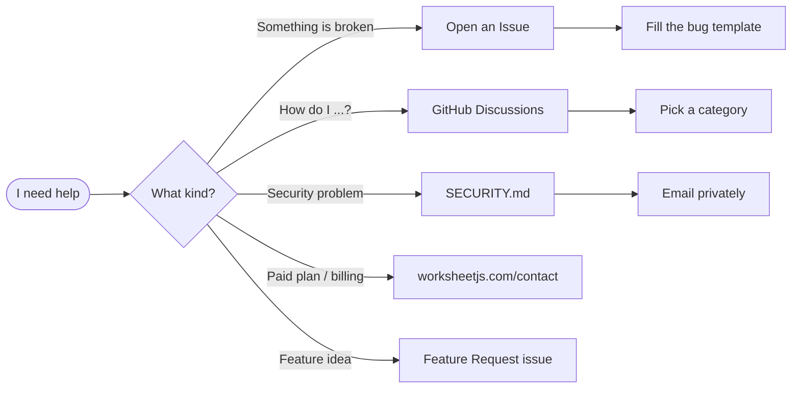

<!-- ============================================================== -->
<!--   WorksheetJS · Community  —  HTML-rendered README             -->
<!-- ============================================================== -->

<a name="top"></a>

<p align="center">
  
</p>

<p align="center">
  
</p>

<h1 align="center">
  
  &nbsp;WorksheetJS&nbsp;·&nbsp;Community&nbsp;
  
</h1>

<p align="center">
  <a href="https://worksheetjs.com">
    
  </a>
</p>

<p align="center">
  <a href="https://worksheetjs.com"></a>
  <a href="https://worksheetjs.com/docs"></a>
  <a href="https://worksheetjs.com/sandbox"></a>
  <a href="../../discussions"></a>
</p>

<p align="center">
  
  
  
  
</p>

<br/>

<!-- ────────────  WHY  ──────────── -->

<h2 align="center">
  
  &nbsp;Why WorksheetJS
</h2>

<p align="center"><i>Four pillars that make WorksheetJS the modern choice for in-browser spreadsheets.</i></p>

<table align="center" width="100%">
  <tr>
    <td align="center" width="25%">
      <br/>
      <b>AI-Native</b><br/>
      <sub>Copilot, formula assistant, smart fill — bring your own key.</sub>
    </td>
    <td align="center" width="25%">
      <br/>
      <b>Canvas-Rendered</b><br/>
      <sub>Buttery 60 FPS scrolling on millions of cells.</sub>
    </td>
    <td align="center" width="25%">
      <br/>
      <b>400+ Formulas</b><br/>
      <sub>VLOOKUP, LAMBDA, dynamic arrays — Excel-compatible.</sub>
    </td>
    <td align="center" width="25%">
      <br/>
      <b>In-Browser</b><br/>
      <sub>Your data never leaves the device.</sub>
    </td>
  </tr>
</table>

<br/>

<!-- ────────────  QUICK NAV  ──────────── -->

<h2 align="center">
  
  &nbsp;Quick Navigation
</h2>

<p align="center"><i>Pick the door that matches what you need.</i></p>

<table align="center" width="100%">
  <tr>
    <td align="center" width="25%">
      <a href="../../issues/new/choose">
        <br/>
        <b>Report a bug</b>
      </a><br/>
      <sub>Something broken?</sub>
    </td>
    <td align="center" width="25%">
      <a href="../../discussions">
        <br/>
        <b>Ask a question</b>
      </a><br/>
      <sub>Usage, ideas, showcase</sub>
    </td>
    <td align="center" width="25%">
      <a href="https://worksheetjs.com/docs">
        <br/>
        <b>Read the docs</b>
      </a><br/>
      <sub>API + guides</sub>
    </td>
    <td align="center" width="25%">
      <a href="https://worksheetjs.com/contact">
        <br/>
        <b>Paid support</b>
      </a><br/>
      <sub>Priority SLA</sub>
    </td>
  </tr>
</table>

<br/>

<!-- ────────────  PACKAGES  ──────────── -->

<h2>
  
  &nbsp;Packages
</h2>

<p>All packages publish under the <a href="https://www.npmjs.com/~worksheetjs"><code>@worksheet-js</code></a> scope on npm — installable in any modern JS/TS project.</p>

<table width="100%">
  <thead>
    <tr>
      <th align="left">Package</th>
      <th align="left">Purpose</th>
      <th align="center">npm</th>
      <th align="center">Docs</th>
    </tr>
  </thead>
  <tbody>
    <tr>
      <td>
        
        &nbsp;<b><code>@worksheet-js/core</code></b>
      </td>
      <td>Headless spreadsheet engine — canvas renderer, 400+ formulas, AI copilot hooks</td>
      <td align="center">
        <a href="https://www.npmjs.com/package/@worksheet-js/core">
          
        </a>
      </td>
      <td align="center">
        <a href="https://worksheetjs.com/api-reference">
          
        </a>
      </td>
    </tr>
    <tr>
      <td>
        
        &nbsp;<b><code>@worksheet-js/react</code></b>
      </td>
      <td>React binding (React ≥ 16.8)</td>
      <td align="center">
        <a href="https://www.npmjs.com/package/@worksheet-js/react">
          
        </a>
      </td>
      <td align="center">
        <a href="https://worksheetjs.com/api-reference">
          
        </a>
      </td>
    </tr>
    <tr>
      <td>
        
        &nbsp;<b><code>@worksheet-js/vue</code></b>
      </td>
      <td>Vue 3 binding</td>
      <td align="center">
        <a href="https://www.npmjs.com/package/@worksheet-js/vue">
          
        </a>
      </td>
      <td align="center">
        <a href="https://worksheetjs.com/api-reference">
          
        </a>
      </td>
    </tr>
    <tr>
      <td>
        
        &nbsp;<b><code>@worksheet-js/formula</code></b>
      </td>
      <td>Standalone formula engine — parser + evaluator</td>
      <td align="center">
        <a href="https://www.npmjs.com/package/@worksheet-js/formula">
          
        </a>
      </td>
      <td align="center">
        <a href="https://worksheetjs.com/api-reference">
          
        </a>
      </td>
    </tr>
    <tr>
      <td>
        
        &nbsp;<b><code>@worksheet-js/excel</code></b>
      </td>
      <td>XLSX / CSV / JSON / HTML I/O with zero fidelity loss</td>
      <td align="center">
        <a href="https://www.npmjs.com/package/@worksheet-js/excel">
          
        </a>
      </td>
      <td align="center">
        <a href="https://worksheetjs.com/api-reference">
          
        </a>
      </td>
    </tr>
    <tr>
      <td>
        
        &nbsp;<b><code>@worksheet-js/plugins</code></b>
      </td>
      <td>AI Copilot, Charts, Pivot Tables (needs <code>chart.js ≥ 4</code>)</td>
      <td align="center">
        <a href="https://www.npmjs.com/package/@worksheet-js/plugins">
          
        </a>
      </td>
      <td align="center">
        <a href="https://worksheetjs.com/api-reference">
          
        </a>
      </td>
    </tr>
  </tbody>
</table>

<p align="center">
  <sub>
    &nbsp;React&nbsp;·&nbsp;
    &nbsp;Vue&nbsp;·&nbsp;
    &nbsp;Angular&nbsp;·&nbsp;
    &nbsp;Svelte&nbsp;·&nbsp;
    &nbsp;vanilla&nbsp;JS&nbsp; — fits your entire stack.
  </sub>
</p>

<br/>

<!-- ────────────  QUICK START  ──────────── -->

<h2>
  
  &nbsp;Three-line quick start
</h2>

```ts
import { createWorksheet } from "@worksheet-js/core";

const sheet = createWorksheet({ element: "#app" });
sheet.loadFromUrl("/data.xlsx");
```

<p align="center">
  <sub>
    
    &nbsp;Full installation, framework bindings, AI copilot setup →
    <a href="https://worksheetjs.com/docs"><b>worksheetjs.com/docs</b></a>
  </sub>
</p>

<br/>

<!-- ────────────  HELP  ──────────── -->

<h2>
  
  &nbsp;Where to go for help
</h2>



<table width="100%">
  <thead>
    <tr><th align="left">I want to…</th><th align="left">Go here</th></tr>
  </thead>
  <tbody>
    <tr>
      <td>&nbsp; Report a reproducible bug</td>
      <td><a href="../../issues/new?template=bug_report.yml">New Bug Report</a></td>
    </tr>
    <tr>
      <td>&nbsp; Request a feature</td>
      <td><a href="../../issues/new?template=feature_request.yml">New Feature Request</a></td>
    </tr>
    <tr>
      <td>&nbsp; Ask how to use something</td>
      <td><a href="../../discussions/categories/q-a">Discussions → Q&amp;A</a></td>
    </tr>
    <tr>
      <td>&nbsp; Show off what you built</td>
      <td><a href="../../discussions/categories/show-and-tell">Discussions → Show &amp; Tell</a></td>
    </tr>
    <tr>
      <td>&nbsp; Privately report a vulnerability</td>
      <td>See <a href="./SECURITY.md"><code>SECURITY.md</code></a></td>
    </tr>
    <tr>
      <td>&nbsp; Get priority support</td>
      <td><a href="https://worksheetjs.com/contact">worksheetjs.com/contact</a></td>
    </tr>
  </tbody>
</table>

<br/>

<!-- ────────────  STAY IN THE LOOP  ──────────── -->

<h2>
  
  &nbsp;Stay in the loop
</h2>

<p align="center">
  <a href="https://worksheetjs.com/changelog"></a>
  <a href="../../releases"></a>
  <a href="../../discussions/categories/announcements"></a>
</p>

<table width="100%">
  <tr>
    <td width="40" align="center"></td>
    <td><b>Release notes</b> live on the website: <a href="https://worksheetjs.com/changelog">worksheetjs.com/changelog</a></td>
  </tr>
  <tr>
    <td align="center"></td>
    <td><b>Watch this repo</b> (top-right) → pick <i>Custom → Releases</i> to get version pings</td>
  </tr>
  <tr>
    <td align="center"></td>
    <td><b>Announcements</b> category in Discussions for roadmap posts &amp; RFCs</td>
  </tr>
</table>

<br/>

<!-- ────────────  POLICIES  ──────────── -->

<h2>
  
  &nbsp;Project policies
</h2>

<table width="100%">
  <thead>
    <tr><th align="left">Document</th><th align="left">What it covers</th></tr>
  </thead>
  <tbody>
    <tr>
      <td>&nbsp; <a href="./SECURITY.md"><code>SECURITY.md</code></a></td>
      <td>Private vuln reporting, AI/BYO-API-key handling, scope</td>
    </tr>
    <tr>
      <td>&nbsp; <a href="./SUPPORT.md"><code>SUPPORT.md</code></a></td>
      <td>Which channel to use when</td>
    </tr>
    <tr>
      <td>&nbsp; <a href="./CODE_OF_CONDUCT.md"><code>CODE_OF_CONDUCT.md</code></a></td>
      <td>Behavior expectations for this community</td>
    </tr>
    <tr>
      <td>&nbsp; <a href="./LICENSE"><code>LICENSE</code></a></td>
      <td>CC BY 4.0 — <b>covers only the docs/snippets in this repo</b>, not the packages</td>
    </tr>
  </tbody>
</table>

<blockquote>
  <p>
    
    &nbsp;<b>Warning.</b> Each <code>@worksheet-js/*</code> package is governed by its own <b>commercial EULA</b>.
    See the package's own <code>LICENSE</code> file or <a href="https://worksheetjs.com/pricing">worksheetjs.com/pricing</a>.
  </p>
</blockquote>

<br/>

<!-- ────────────  FOOTER  ──────────── -->

<p align="center">
  
</p>

<p align="center">
  <sub><b>Built with
    
    by the WorksheetJS team</b></sub><br/>
  <sub>
    <a href="https://worksheetjs.com">worksheetjs.com</a> ·
    <a href="https://worksheetjs.com/docs">docs</a> ·
    <a href="https://worksheetjs.com/sandbox">sandbox</a> ·
    <a href="https://worksheetjs.com/pricing">pricing</a>
  </sub>
</p>
