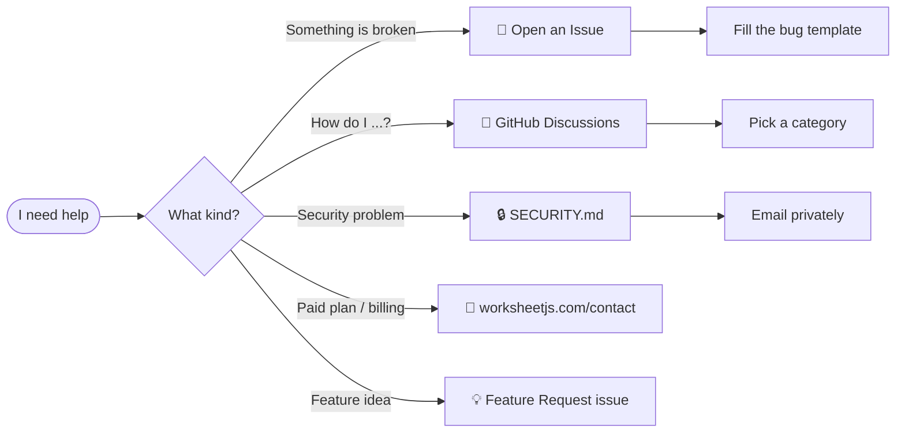

<div align="center">


<h1>
  📊 WorksheetJS · Community
</h1>

<p>
  <b>The public home for issues, discussions, and announcements</b><br/>
  for the <code>@worksheet-js/*</code> package family.
</p>

<p>
  <a href="https://worksheetjs.com"></a>
  <a href="https://worksheetjs.com/docs"></a>
  <a href="https://worksheetjs.com/sandbox"></a>
  <a href="../../discussions"></a>
</p>

<p>
  
  
  
  
</p>

<sub>AI-powered spreadsheet engine for the web · 400+ formulas · canvas-rendered · zero-fidelity XLSX I/O</sub>

</div>

---

## 🧭 Quick Navigation

<table>
<tr>
  <td align="center" width="25%">
    <a href="../../issues/new/choose"><b>🐛 Report a bug</b></a><br/>
    <sub>Something broken?</sub>
  </td>
  <td align="center" width="25%">
    <a href="../../discussions"><b>💬 Ask a question</b></a><br/>
    <sub>Usage, ideas, showcase</sub>
  </td>
  <td align="center" width="25%">
    <a href="https://worksheetjs.com/docs"><b>📚 Read the docs</b></a><br/>
    <sub>API + guides</sub>
  </td>
  <td align="center" width="25%">
    <a href="https://worksheetjs.com/contact"><b>💼 Paid support</b></a><br/>
    <sub>Priority SLA</sub>
  </td>
</tr>
</table>

---

## 📌 What this repo is (and isn't)

> [!IMPORTANT]
> This repository is a **community hub only**. The source code for all `@worksheet-js/*` packages is **proprietary** and lives in a private repository.

<table>
<tr>
<th width="50%">✅ This repo IS for</th>
<th width="50%">❌ This repo is NOT for</th>
</tr>
<tr>
<td>

- Reporting bugs in published packages
- Requesting features
- Asking usage questions (Discussions)
- Sharing what you built (Showcase)
- Tracking release announcements
- Reading security policy

</td>
<td>

- Source code (it's proprietary)
- Pull requests (we don't accept external PRs)
- License issues (each package has its own commercial license)
- Paid-plan billing (use [contact](https://worksheetjs.com/contact))

</td>
</tr>
</table>

---

## 📦 Packages

All packages are published under the [`@worksheet-js`](https://www.npmjs.com/~worksheetjs) scope on npm.

<table>
<thead>
<tr>
  <th align="left">Package</th>
  <th align="left">Purpose</th>
  <th align="center">npm</th>
  <th align="center">Docs</th>
</tr>
</thead>
<tbody>
<tr>
  <td><b><code>@worksheet-js/core</code></b></td>
  <td>Headless spreadsheet engine — canvas renderer, 400+ formulas, AI copilot hooks</td>
  <td align="center"><a href="https://www.npmjs.com/package/@worksheet-js/core"></a></td>
  <td align="center"><a href="https://worksheetjs.com/api-reference">📖</a></td>
</tr>
<tr>
  <td><b><code>@worksheet-js/react</code></b></td>
  <td>React binding (React ≥ 16.8)</td>
  <td align="center"><a href="https://www.npmjs.com/package/@worksheet-js/react"></a></td>
  <td align="center"><a href="https://worksheetjs.com/api-reference">📖</a></td>
</tr>
<tr>
  <td><b><code>@worksheet-js/vue</code></b></td>
  <td>Vue 3 binding</td>
  <td align="center"><a href="https://www.npmjs.com/package/@worksheet-js/vue"></a></td>
  <td align="center"><a href="https://worksheetjs.com/api-reference">📖</a></td>
</tr>
<tr>
  <td><b><code>@worksheet-js/formula</code></b></td>
  <td>Standalone formula engine — parser + evaluator</td>
  <td align="center"><a href="https://www.npmjs.com/package/@worksheet-js/formula"></a></td>
  <td align="center"><a href="https://worksheetjs.com/api-reference">📖</a></td>
</tr>
<tr>
  <td><b><code>@worksheet-js/excel</code></b></td>
  <td>XLSX / CSV / JSON / HTML I/O with zero fidelity loss</td>
  <td align="center"><a href="https://www.npmjs.com/package/@worksheet-js/excel"></a></td>
  <td align="center"><a href="https://worksheetjs.com/api-reference">📖</a></td>
</tr>
<tr>
  <td><b><code>@worksheet-js/plugins</code></b></td>
  <td>AI Copilot, Charts, Pivot Tables (needs <code>chart.js ≥ 4</code>)</td>
  <td align="center"><a href="https://www.npmjs.com/package/@worksheet-js/plugins"></a></td>
  <td align="center"><a href="https://worksheetjs.com/api-reference">📖</a></td>
</tr>
</tbody>
</table>

> Supports React · Vue · Angular · Svelte · vanilla JS · runs fully in-browser · your data never leaves the device.

---

## 🧩 Three-line quick start

```ts
import { createWorksheet } from "@worksheet-js/core";

const sheet = createWorksheet({ element: "#app" });
sheet.loadFromUrl("/data.xlsx");
```

Full installation, framework bindings, AI copilot setup → [worksheetjs.com/docs](https://worksheetjs.com/docs).

---

## 🆘 Where to go for help



| I want to... | Go here |
|---|---|
| Report a reproducible bug | [New Bug Report](../../issues/new?template=bug_report.yml) |
| Request a feature | [New Feature Request](../../issues/new?template=feature_request.yml) |
| Ask how to use something | [Discussions → Q&A](../../discussions/categories/q-a) |
| Show off what you built | [Discussions → Show & Tell](../../discussions/categories/show-and-tell) |
| Privately report a vulnerability | See [`SECURITY.md`](./SECURITY.md) |
| Get priority support | [worksheetjs.com/contact](https://worksheetjs.com/contact) |

---

## 📣 Stay in the loop

<p>
  <a href="https://worksheetjs.com/changelog"></a>
  <a href="../../releases"></a>
  <a href="../../discussions/categories/announcements"></a>
</p>

- **Release notes** live on the website: [worksheetjs.com/changelog](https://worksheetjs.com/changelog)
- **Watch this repo** (🔔 top-right) → pick *Custom → Releases* to get version pings
- **Announcements** category in Discussions for roadmap posts & RFCs

---

## 📜 Project policies

| Document | What it covers |
|---|---|
| [`SECURITY.md`](./SECURITY.md) | Private vuln reporting, AI/BYO-API-key handling, scope |
| [`SUPPORT.md`](./SUPPORT.md) | Which channel to use when |
| [`CODE_OF_CONDUCT.md`](./CODE_OF_CONDUCT.md) | Behavior expectations for this community |
| [`LICENSE`](./LICENSE) | CC BY 4.0 — **covers only the docs/snippets in this repo**, not the packages |

> ⚠️ Each `@worksheet-js/*` package is governed by its own **commercial EULA**. See the package's own `LICENSE` file or [worksheetjs.com/pricing](https://worksheetjs.com/pricing).

---

## 🙏 A note on contributions

We're grateful you'd want to contribute — but this repo doesn't host source code, and we don't currently accept external pull requests. If you've found an issue or have a proposal, please **open an issue or discussion instead**. Ideas from the community directly shape the roadmap.

---

<div align="center">

<sub>Built with ❤️ by the WorksheetJS team · <a href="https://worksheetjs.com">worksheetjs.com</a></sub>

</div>
